# Pechakucha

<div id= "slideshow">

```{include} _static/play_pause.html
```


```{card}
:class-card: slide

```

```{card}
:class-card: slide
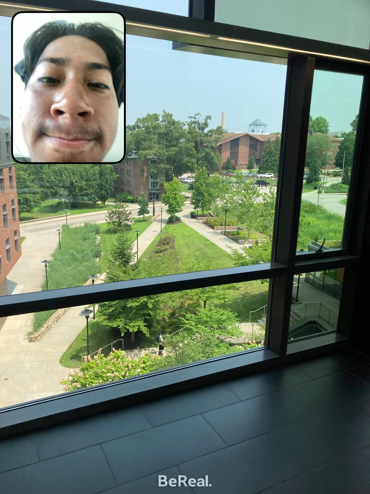
```

```{card}
:class-card: slide

```

```{card}
:class-card: slide
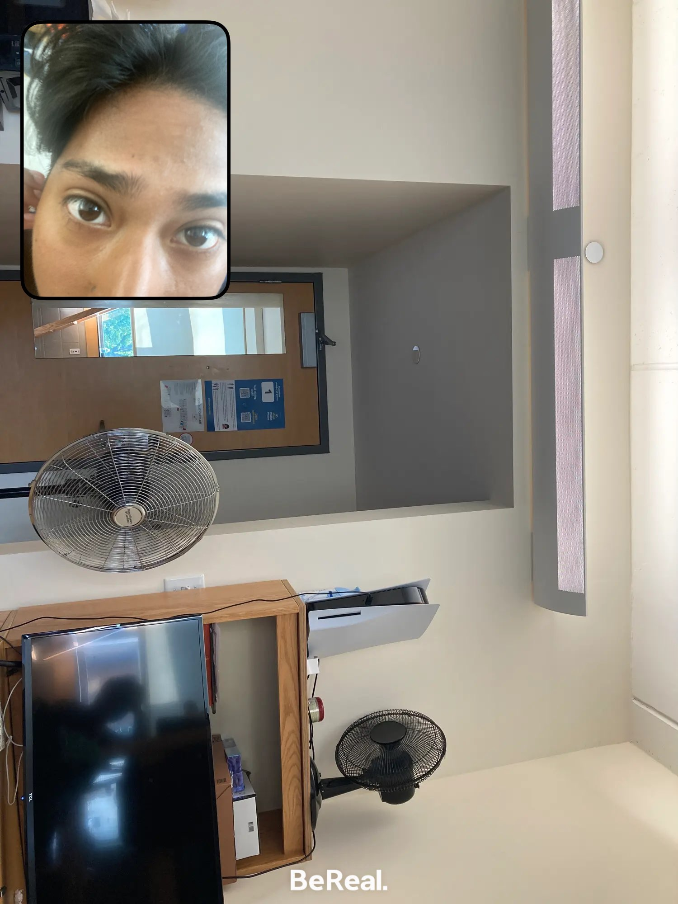
```

```{card}
:class-card: slide

```

```{card}
:class-card: slide
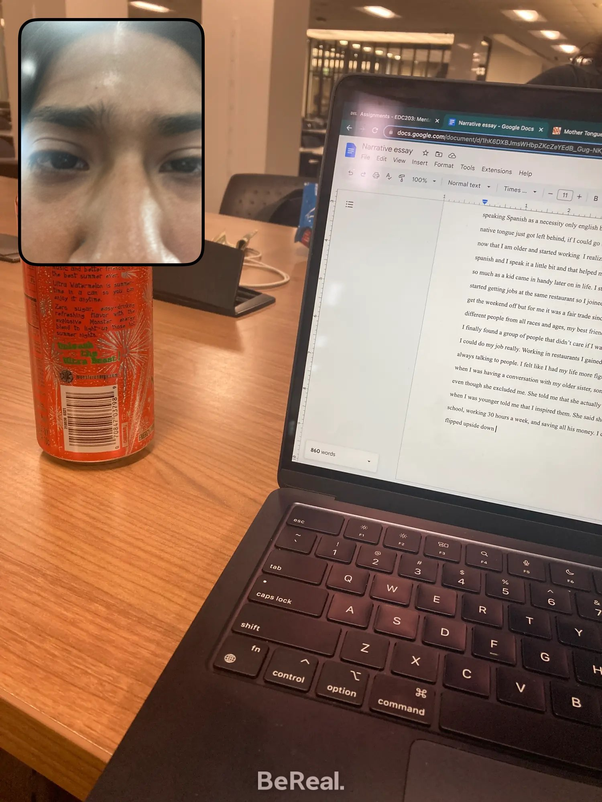
```

```{card}
:class-card: slide

```

```{card}
:class-card: slide
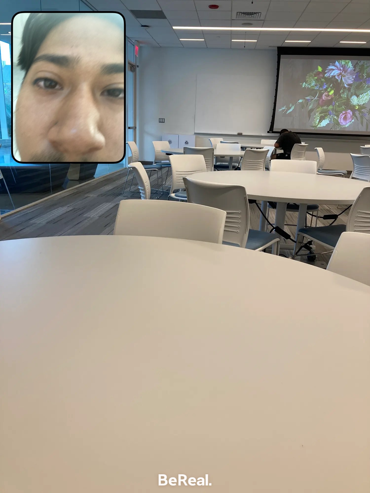
```
```{card}
:class-card: slide

```

```{card}
:class-card: slide
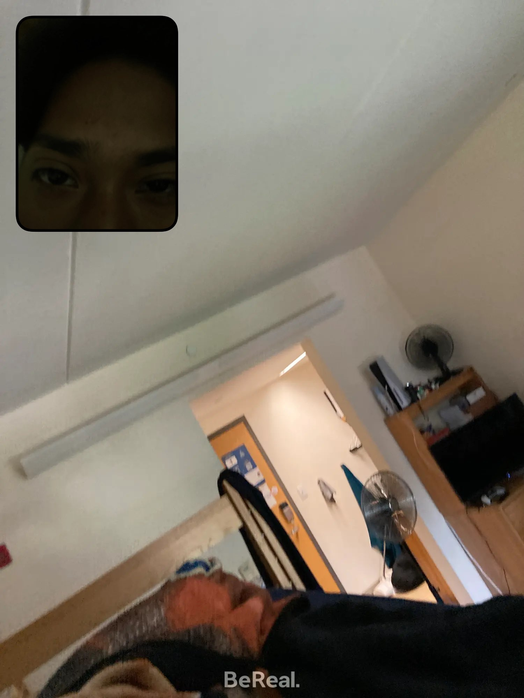
```

```{card}
:class-card: slide
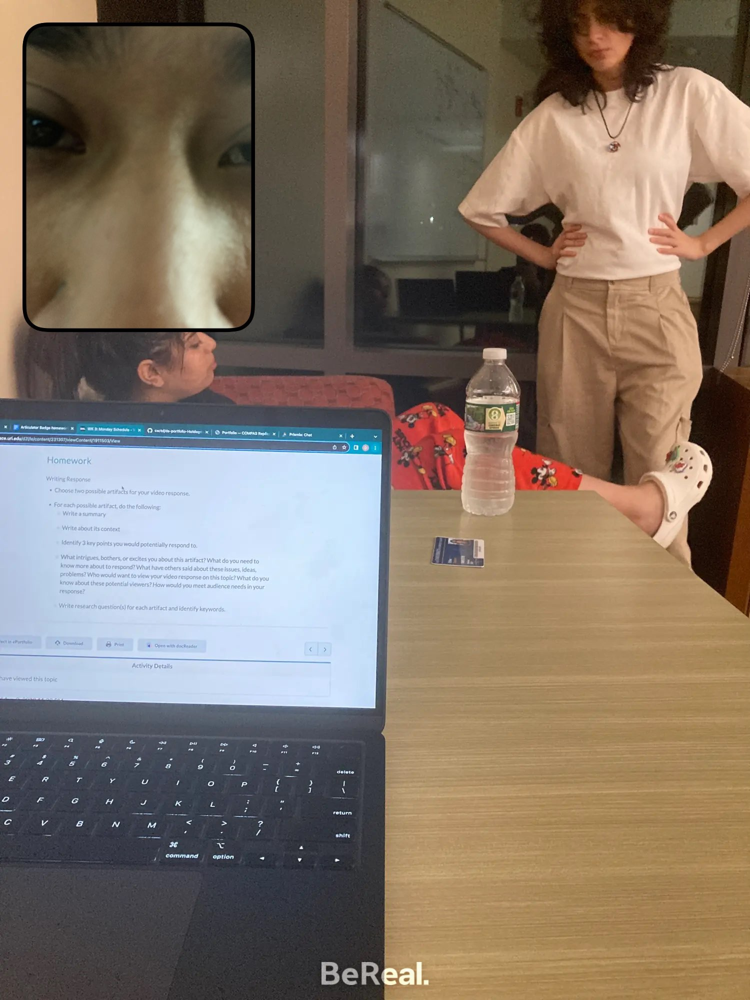
```

```{card}
:class-card: slide
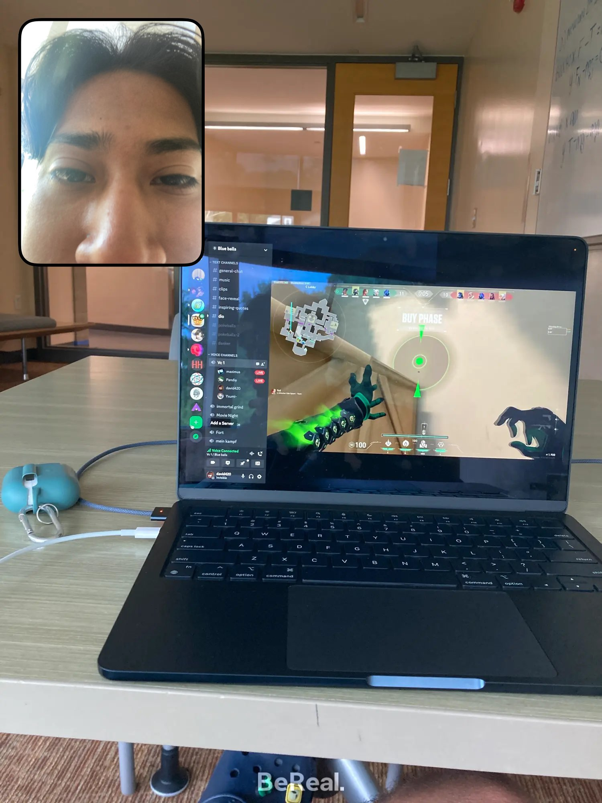
```

```{card}
:class-card: slide
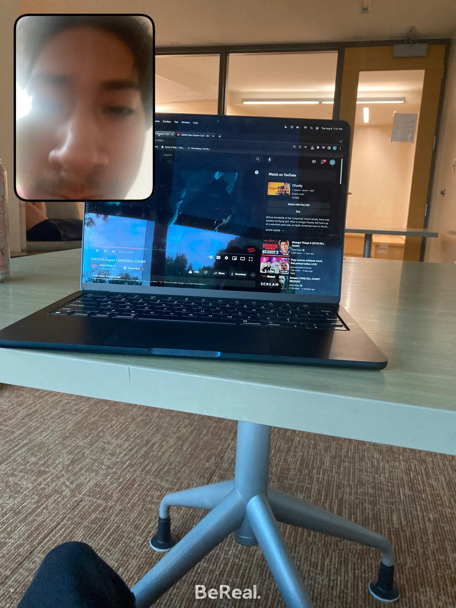
```

```{card}
:class-card: slide
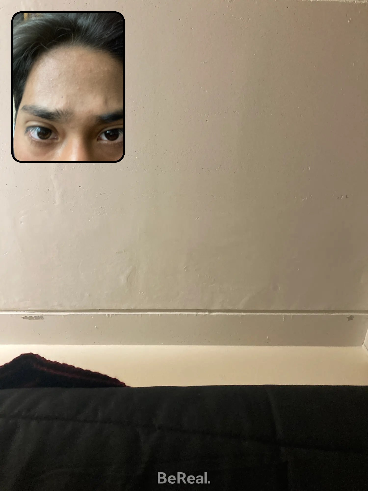
```

```{card}
:class-card: slide
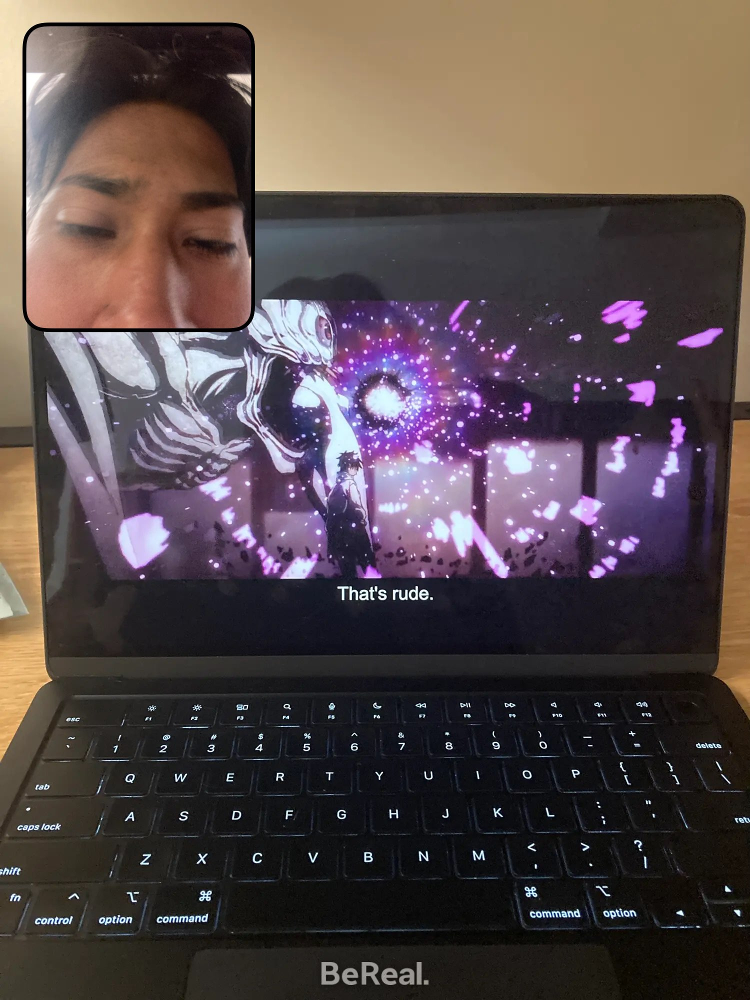
```

```{card}
:class-card: slide

```

```{card}
:class-card: slide
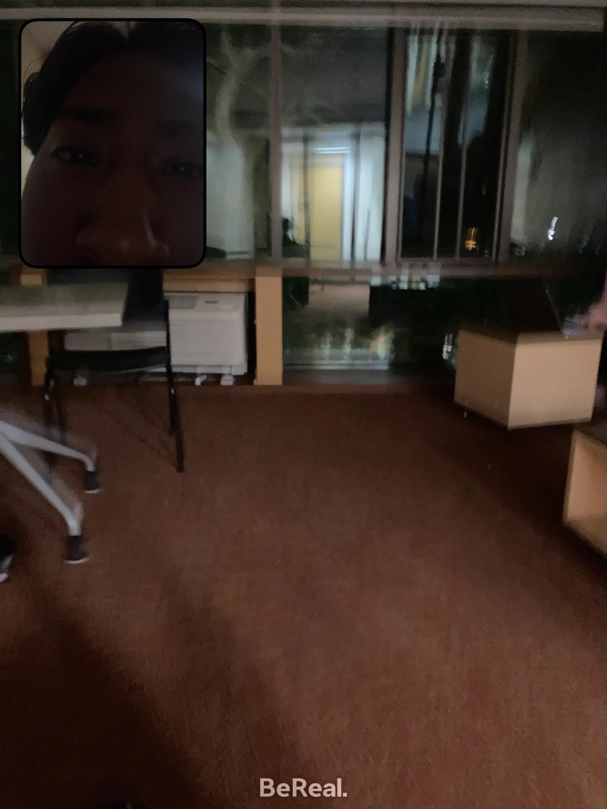
```

```{card}
:class-card: slide

```

```{card}
:class-card: slide

```

```{card}
:class-card: slide
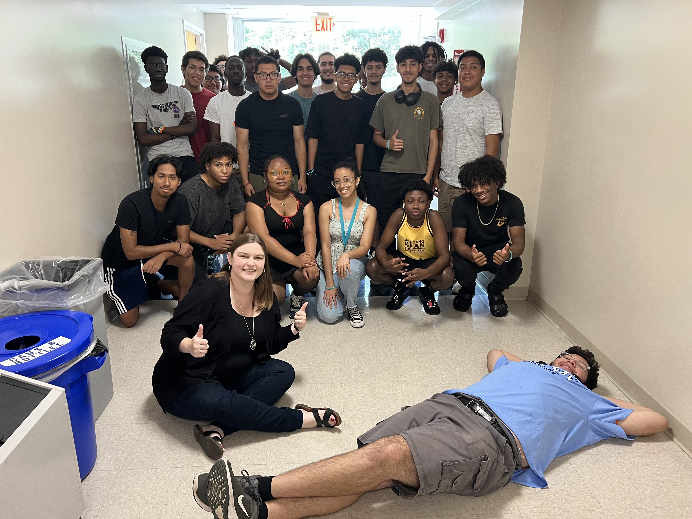
```

</div>
